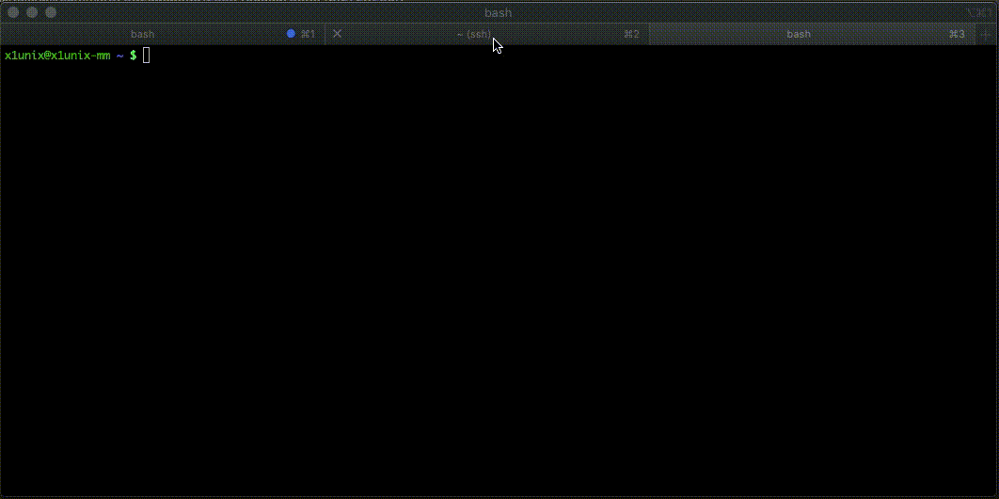

# TelShell

Tiny Telnet shell server in Go



## Download

```bash
curl https://raw.githubusercontent.com/x1unix/telshell/master/install.sh | sh
```

Also, you can grab latest release from [here](https://github.com/x1unix/telshell/releases/latest)

## Usage

```bash
./telshell -addr=:5000
```

We also recommend `-s=-i` argument to start shell in *interactive* mode

Use `-help` to get help about additional params
